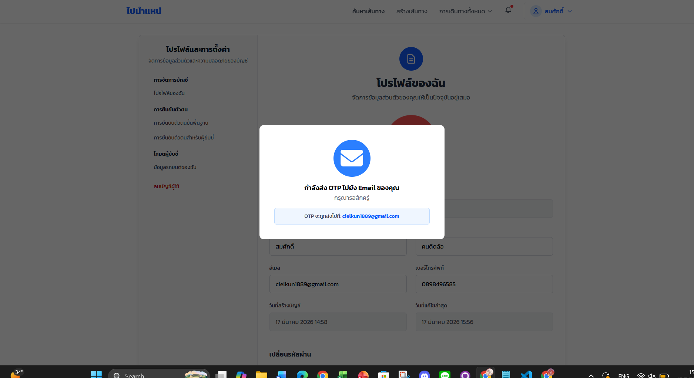

**คู่มือการใช้งาน PaiNamNae**    
\#15, \#16,\#1 (User Manual)

**ยินดีต้อนรับสู่ PaiNamNae**  
สารบัญ  
1\. \#15 As a passenger, I want to give a review for each ride that I took to support the community.  
2\. \#16 As a user, I want my account and information to be removed from the system when I am no longer want to be apart of this community.  
3\. \#1 As an admin, I want a log that complies to the related law.

**15\. As a passenger, I want to give a review for each ride that I took to support the community.**

ฟีเจอร์นี้ออกแบบมาเพื่อให้ผู้โดยสาร (Passenger) สามารถให้ข้อมูลย้อนกลับ (Feedback) เกี่ยวกับการเดินทาง เพื่อสร้างสังคมการใช้งานที่ดีและสนับสนุนคนขับที่มีคุณภาพ

**ขั้นตอนการรีวิวการเดินทาง**  
เมื่อการเดินทางสิ้นสุดลงและคนขับกดจบงาน ระบบจะแสดงหน้าจอสรุปการเดินทาง ผู้โดยสารสามารถดำเนินการได้ดังนี้:

1\.  การให้คะแนน (Rating)  
ผู้ใช้สามารถ กดเลือกจำนวนดาวที่คุณต้องการให้ (โดยจะมีค่าตั้งแต่ 1,2,3,4,5 ดาว) โดยที่ระบบรองรับการให้คะแนนแบบจำนวนเต็ม 

2\.  เลือกป้ายกำกับคำชม (Positive Labels)  
เลือกสิ่งที่ประทับใจจากตัวเลือกที่มีให้ ได้แก่ “ขับขี่ปลอดภัย”, “สะอาด รอน่านั่ง”,  
	   “คนขับอัธยาศัยดี”, “ชอบเพลงที่เปิด”

3\. เขียนความคิดเห็น (Comment)  
	พิมพ์ข้อความรีวิวเพิ่มเติมในช่องว่างเพื่อบอกเล่าประสบการณ์  

4\.  แนบรูปภาพ และวิดีโอ (Upload Photos and Videos)  
สามารถอัปโหลดรูปภาพและวิดีโอประกอบการรีวิวได้สูงสุด 3 ไฟล์และขนาดไม่เกิน 10 MB หากใส่ไฟล์ผิดประเภทจะขึ้นข้อความแจ้งเตือน  

5\.  ยืนยันการรีวิว  
กดปุ่ม “บันทึก” เพื่อส่งรีวิวเมื่อกรอกข้อมูลครบถ้วน โดยจะสามารถรีวิวได้ภายใน 7 วันหลังจากการเดินทางสิ้นสุด  

6\. การแสดงผล  
	เมื่อรีวิวเรียบร้อยแล้วจะแสดงผลดังภาพ โดยสามารถกดที่ไฟล์ภาพหรือวิดีโอเพื่อดูแบบเต็มจอได้

**\#16 As a user, I want my account and information to be removed from the system when I am no longer want to be a part of this community.**

ฟีเจอร์นี้ช่วยให้ผู้ใช้งานจัดการข้อมูลส่วนบุคคลตาม พ.ร.บ. คุ้มครองข้อมูลส่วนบุคคล (PDPA) โดยการลบบัญชีเพื่อไม่ให้สามารถระบุตัวตนได้ในแพลตฟอร์ม

**ขั้นตอนการขอลบบัญชี**  
1\. เข้าสู่เมนูตั้งค่า  
ในหน้า “โปรไฟล์ของฉัน” ผู้ใช้สามารถใช้เมนู “ลบบัญชีผู้ใช้ ” บริเวณแถบเมนูด้านซ้าย   
	

 

2\.  ยอมรับเงื่อนไข  
	ระบบจะแสดงหน้าต่างแจ้งเตือนเกี่ยวกับผลกระทบของการลบบัญชี และนโยบาย PDPA ผู้ใช้สามารถคลิกที่ช่องสี่เหลี่ยม “ยอมรับข้อกำหนดและเงื่อนไข” จากนั้นกดปุ่ม           “ยืนยันการลบ”

	  
3\.  การกรอกรหัสผ่าน   
ระบบจะให้กรอก “รหัสผ่าน(Password)” ของบัญชีนั้นๆ อีกครั้งเพื่อยืนยันความปลอดภัยกรอกรหัสผ่านให้ถูกต้องแล้วกดปุ่ม “ยืนยัน” หากรหัสผ่านไม่ถูกต้องจำทำการแจ้งเตือนและย้อนกลับไปหน้าเดิม

หากผู้ใช้มีรายการเดินทางที่ค้างไว้ ระบบจะแจ้งเตือน

4\.  ระบบจะส่ง OTP  
	ระบบจะแจ้งการส่ง OTP ไปยังอีเมลของผู้ใช้ที่สมัครใช้บริการ  

5.กรอก  OTP  
	ผู้ใช้กรอก OTP ที่ได้รับมาจากอีเมล ภายในระเวลาที่กำหนด ภายใน 5 นาที หากผู้ใช้ไม่ได้รับ OTP ภายในระยะเวลา ผู้ใช้จะสามารถรับ OTP ใหม่ได้

6\. ตรวจสอบผลลัพธ์  
กรณีสำเร็จ : ระบบขึ้นแสดงเครื่องหมายถูกสีเขียว  “ลบบัญชีสำเร็จแล้ว” และส่งอีเมลยืนยันการลบข้อมูลตามกฎหมาย

7\. การรับไฟล์  
เมื่อทำการลบบัญชีเรียบร้อยแล้ว ระบบจะทำการส่งไฟล์ไปที่อีเมลที่ผู้ใช้กรอกเข้าไปเป็นไฟล์ .zip โดยผู้ใช้จะต้องใช้เลขประจำตัวประชาชนในการแตกไฟล์จึงจะได้ไฟล์ .json 

ไฟล์ .json  

**\#1 As an admin, I want a log that complies to the related law.**

	ฟีเจอร์นี้ออกแบบมาเพื่อให้ผู้ดูแลระบบ (Admin) สามารถดูและส่งออกข้อมูล Log File ตาม พ.ร.บ. คอมฯ 2560 มาตรา 26

1\. หน้า Log System  
เมื่อผู้ดูแลเข้าสู่ระบบแล้วให้ทำการเข้าไปที่หน้า Dashborad เมนู Log จะอยู่ทางซ้ายมือดังภาพ  

2\.  การกรอง  
โดยเมื่อเข้าสู่หน้า Log จะแสดงฟิลเตอร์ต่างๆประกอบด้วย

* ระยะเวลา (วันที่เริ่มต้น วันที่สิ้นสุด)   
* การค้นหาชื่อผู้ใช้  
* IP address  
* ผลลัพธ์  
* หมวดหมู่

ซึ่งสามารถเลือกได้ว่าจะใช้ต้วกรองใดบ้างโดยไม่บังคับ โดยในหน้าของหมวดหมู่จะประกอบด้วย

* Authentication  
* User Management  
* Vehicle Management  
* Booking  
* Route  
* Driver Verification  
* Admin Actions  
* System 

3\. การ Export  
โดยเมื่อกดปุ่ม Export จะขึ้นให้เลือกหน้าให้เลือกสิ่งที่ส่งออกเพิ่มเติมซึ่งเป็นข้อมูลของผู้ใช้ประกอบด้วย 

* ชื่อผู้ใช้  
* ชื่อ  
* นามสกุล  
* อีเมล   
* เบอร์โทรศัพท์   
* เลขบัตรประชาชน   
* บทบาทผู้ใช้

ซึ่งสามารถเลือกได้ว่าจะใช้ต้วกรองใดบ้างโดยไม่บังคับ และเมื่อคลิกปุ่ม export log file จะสามารถดาวน์โหลด Log ที่กรองออกมานั้นเป็นไฟล์ .json หรือ .csv เพื่อนำไปใช้ในทางกฎหมายได้  

4\. การตรวจสอบการแก้ไขของไฟล์ Log ที่ถูก Export   
	เมื่อกด Export แล้วจะได้ไฟล์ .Zip เมื่อแตกไฟล์แล้วจะมีทั้งหมด 4 ไฟล์ ได้แก่ audit\_log.csv , howto.txt , public\_key.pem , signature.sig

Howto.txt เมื่อเปิดไฟล์ how to.txt จะแสดงเกี่ยวกับวิธีการตรวจสอบความถูกต้องของไฟล์

เมื่อไฟล์ Csv ถูกแก้ไขแล้วนำไปตรวจสอบความถูกต้องขึ้นว่า  “ **Verifica tion failure”**

