# คู่มือการใช้งาน PaiNamNae

**ฟีเจอร์:** #15, #16, #1

---

## ยินดีต้อนรับสู่ PaiNamNae

### สารบัญ

1. [#15 ให้คะแนนการเดินทาง](#15-ให้คะแนนการเดินทาง)
2. [#16 ลบบัญชีผู้ใช้](#16-ลบบัญชีผู้ใช้)
3. [#1 ระบบ Log สำหรับผู้ดูแลระบบ](#1-ระบบ-log-สำหรับผู้ดูแลระบบ)

---

## #15 ให้คะแนนการเดินทาง

**ชื่อฟีเจอร์:** As a passenger, I want to give a review for each ride that I took to support the community.

### คำอธิบาย

ฟีเจอร์นี้ออกแบบมาเพื่อให้ผู้โดยสาร (Passenger) สามารถให้ข้อมูลย้อนกลับ (Feedback) เกี่ยวกับการเดินทาง เพื่อสร้างสังคมการใช้งานที่ดีและสนับสนุนคนขับที่มีคุณภาพ

### ขั้นตอนการรีวิวการเดินทาง

เมื่อการเดินทางสิ้นสุดลงและคนขับกดจบงาน ระบบจะแสดงหน้าจอสรุปการเดินทาง ผู้โดยสารสามารถดำเนินการได้ดังนี้:

#### 1. การให้คะแนน (Rating)

ผู้ใช้สามารถกดเลือกจำนวนดาวที่ต้องการให้โดยจะมีค่าตั้งแต่ 1 ถึง 5 ดาว ระบบรองรับการให้คะแนนแบบจำนวนเต็ม

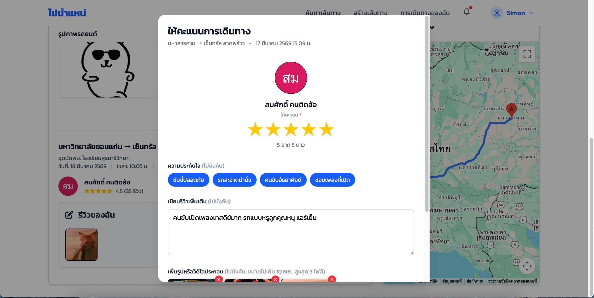

#### 2. เลือกป้ายกำกับคำชม (Positive Labels)

เลือกสิ่งที่ประทับใจจากตัวเลือกที่มีให้:

- ขับขี่ปลอดภัย
- สะอาด นั่งสบาย
- คนขับอัธยาศัยดี
- ชอบเพลงที่เปิด

#### 3. เขียนความคิดเห็น (Comment)

พิมพ์ข้อความรีวิวเพิ่มเติมในช่องว่างเพื่อบอกเล่าประสบการณ์

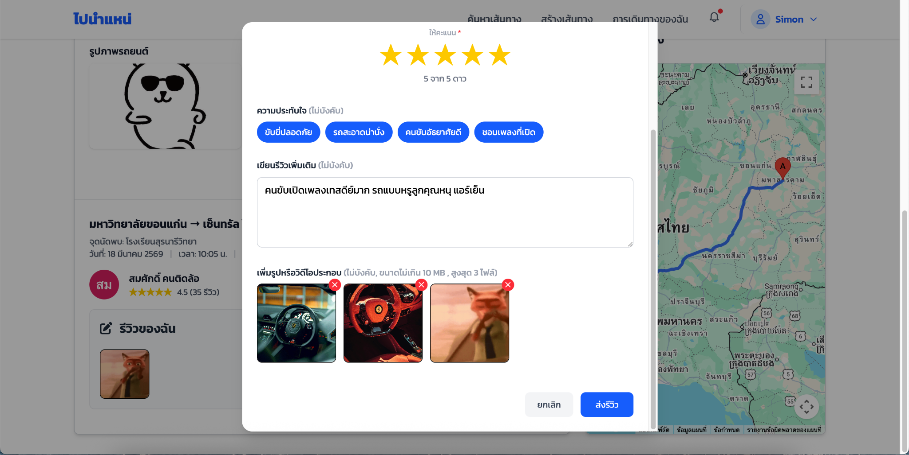

#### 4. แนบรูปภาพและวิดีโอ (Upload Photos and Videos)

- สามารถอัปโหลดรูปภาพและวิดีโอประกอบการรีวิวได้สูงสุด **3 ไฟล์**
- ขนาดไฟล์ไม่เกิน **10 MB**
- หากใส่ไฟล์ผิดประเภท ระบบจะแจ้งเตือน

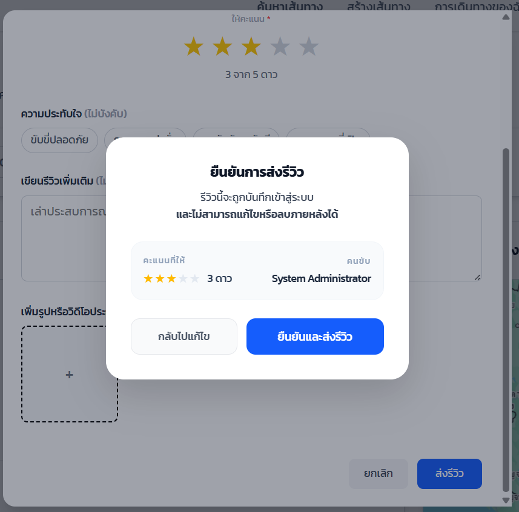

#### 5. ยืนยันการรีวิว

- กดปุ่ม "บันทึก" เพื่อส่งรีวิว
- จำเป็นต้องกรอกข้อมูลครบถ้วน
- สามารถรีวิวได้ภายใน **7 วันหลังจากการเดินทางสิ้นสุด**

#### 6. การแสดงผลลัพธ์

เมื่อรีวิวเรียบร้อยแล้ว ระบบจะแสดงผลลัพธ์ โดยสามารถกดที่ไฟล์ภาพหรือวิดีโอเพื่อดูแบบเต็มจอได้

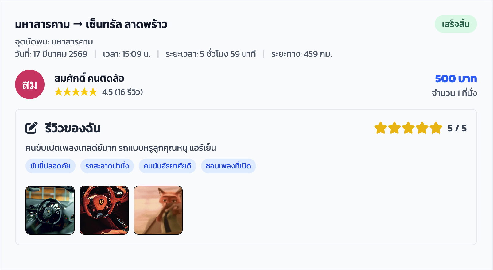

---

## #16 ลบบัญชีผู้ใช้

**ชื่อฟีเจอร์:** As a user, I want my account and information to be removed from the system when I am no longer want to be a part of this community.

### คำอธิบาย

ฟีเจอร์นี้ช่วยให้ผู้ใช้งานจัดการข้อมูลส่วนบุคคลตาม พ.ร.บ. คุ้มครองข้อมูลส่วนบุคคล (PDPA) โดยการลบบัญชีเพื่อไม่ให้สามารถระบุตัวตนได้ในแพลตฟอร์ม

### ขั้นตอนการขอลบบัญชี

#### 1. เข้าสู่เมนูตั้งค่า

ในหน้า "โปรไฟล์ของฉัน" ผู้ใช้สามารถใช้เมนู "ลบบัญชีผู้ใช้" บริเวณแถบเมนูด้านซ้าย


#### 2. ยอมรับเงื่อนไข

ระบบจะแสดงหน้าต่างแจ้งเตือนเกี่ยวกับผลกระทบของการลบบัญชี และนโยบาย PDPA ผู้ใช้สามารถ:

- คลิกที่ช่องสี่เหลี่ยม "ยอมรับข้อกำหนดและเงื่อนไข"
- กดปุ่ม "ยืนยันการลบ"

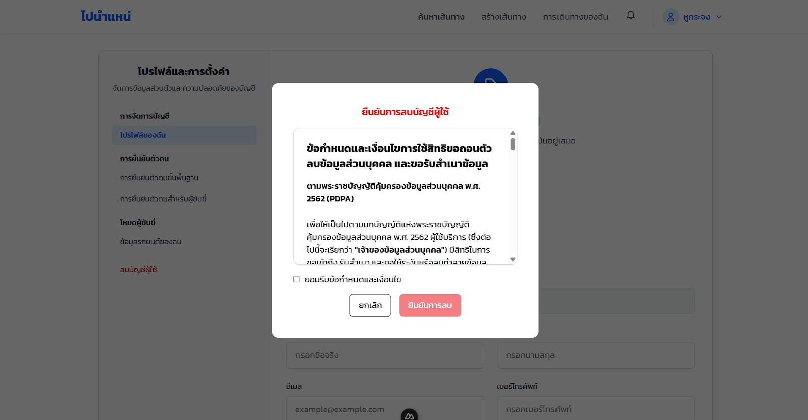

#### 3. การกรอกรหัสผ่าน

ระบบจะให้กรอก "รหัสผ่าน (Password)" ของบัญชีนั้นๆ อีกครั้งเพื่อยืนยันความปลอดภัย

- กรอกรหัสผ่านให้ถูกต้อง
- กดปุ่ม "ยืนยัน"
- หากรหัสผ่านไม่ถูกต้อง ระบบจะแจ้งเตือนและย้อนกลับไปหน้าเดิม

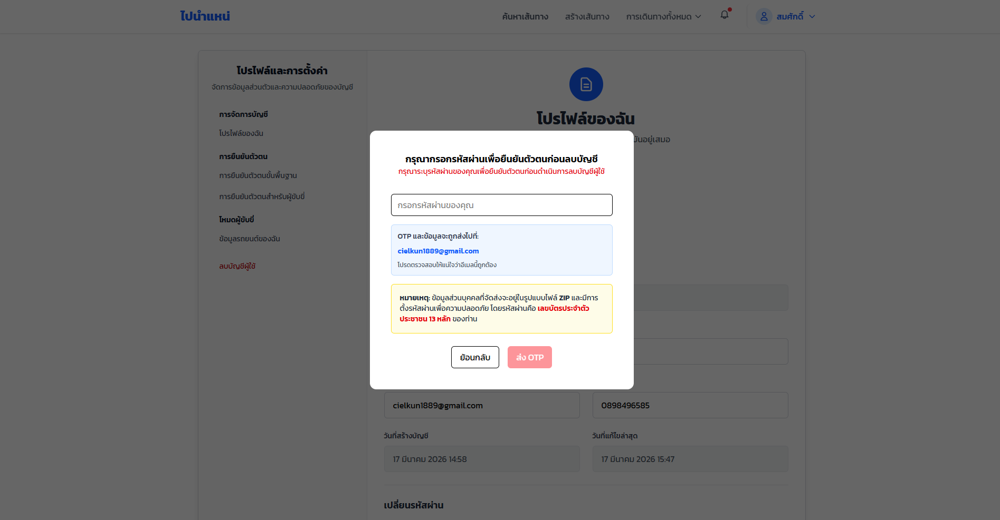

#### 4. การตรวจสอบรายการเดินทางค้าง

หากผู้ใช้มีรายการเดินทางที่ค้างไว้ ระบบจะแจ้งเตือน


#### 5. ระบบส่ง OTP

ระบบจะแจ้งการส่ง OTP ไปยังอีเมลของผู้ใช้ที่สมัครใช้บริการ

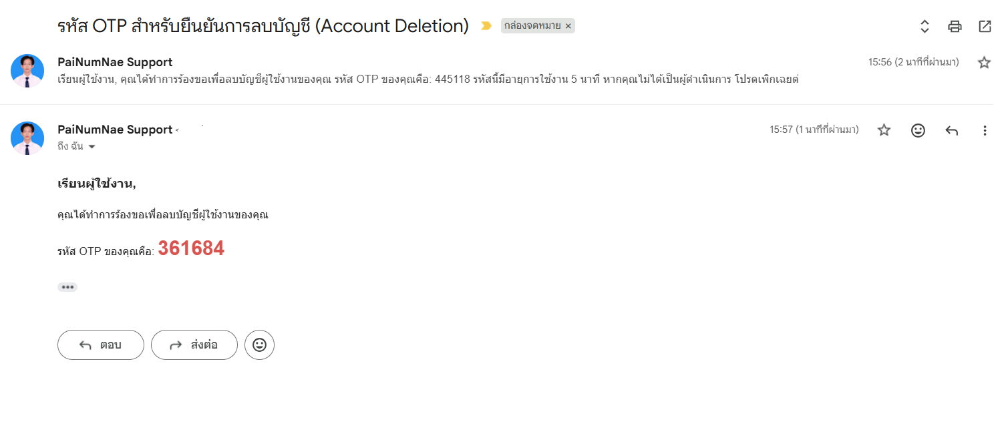

#### 6. การกรอก OTP

ผู้ใช้สามารถดำเนินการต่อไปนี้:

- กรอก OTP ที่ได้รับจากอีเมล
- ต้องกรอก **ภายใน 5 นาที**
- หากไม่ได้รับ OTP สามารถขอ OTP ใหม่ได้

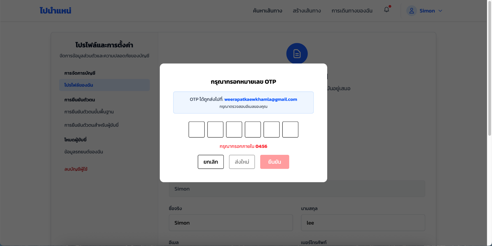


#### 7. ตรวจสอบผลลัพธ์

**กรณีสำเร็จ:**
- ระบบแสดงเครื่องหมายถูกสีเขียว "ลบบัญชีสำเร็จแล้ว"
- ส่งอีเมลยืนยันการลบข้อมูลตามกฎหมาย

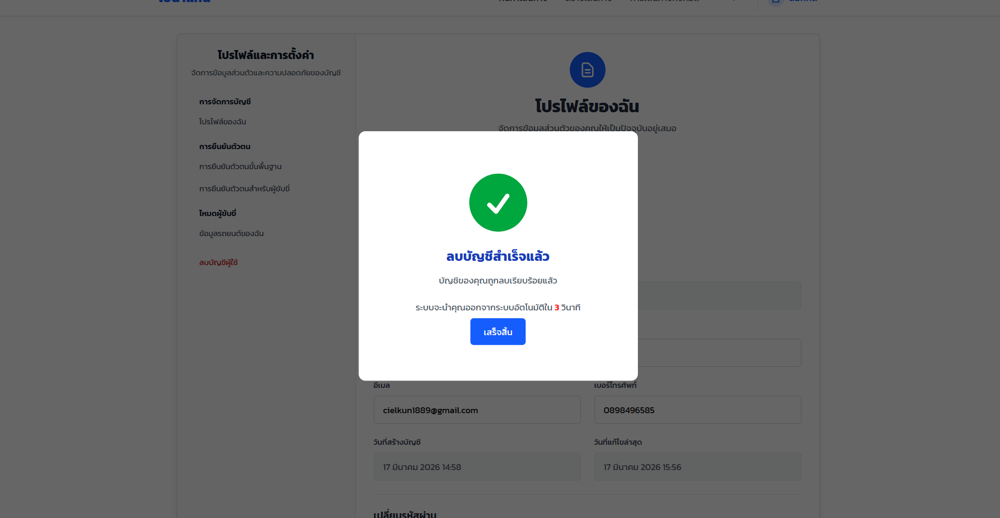

#### 8. การรับไฟล์ข้อมูลส่วนบุคคล

เมื่อทำการลบบัญชีเรียบร้อยแล้ว:

- ระบบส่งไฟล์ไปที่อีเมลของผู้ใช้เป็นไฟล์ `.zip`
- ต้องใช้**เลขประจำตัวประชาชน**ในการแตกไฟล์
- ได้ไฟล์ `.json` เมื่อแตกไฟล์สำเร็จ

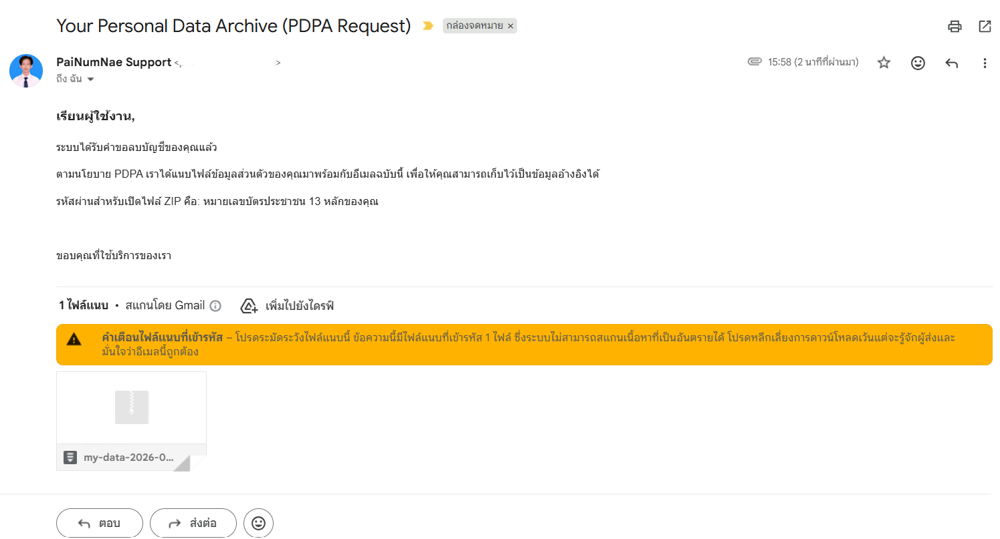

**กรอกด้วยรหัสบัตรประจำตัวประชาชน**

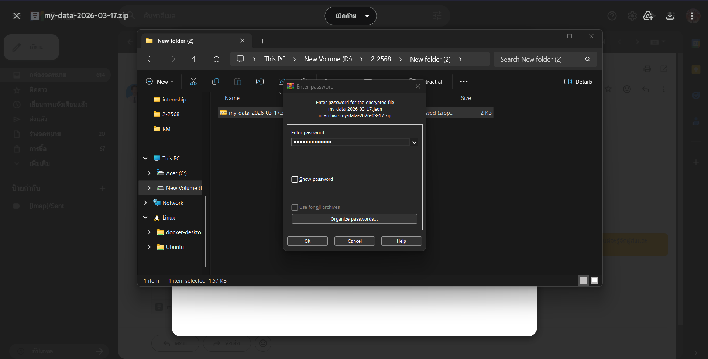

**เนื้อหาในไฟล์ JSON**
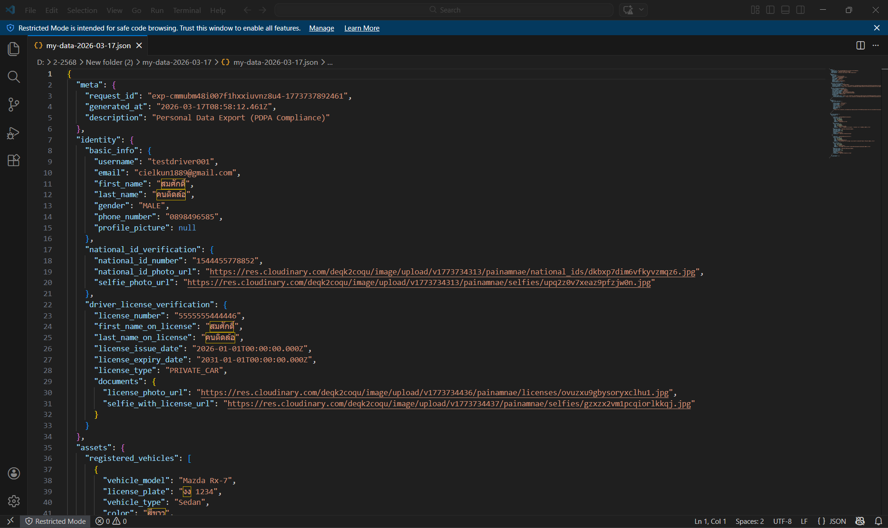

| หมวดหมู่ | รายการ | คำอธิบาย |
|----------|--------|-----------|
| **Meta** | Request ID | รหัสคำขอสำหรับการส่งออกข้อมูลส่วนบุคคล ใช้สำหรับอ้างอิงคำขอแต่ละครั้ง |
| | Generated At | วันและเวลาที่ระบบสร้างไฟล์ข้อมูลนี้ขึ้น |
| | Description | คำอธิบายประเภทของไฟล์ แสดงวัตถุประสงค์ของการส่งออกข้อมูล |
| **Basic Info** | Username | ชื่อผู้ใช้สำหรับเข้าสู่ระบบ |
| | Email | อีเมลของผู้ใช้งาน ใช้สำหรับติดต่อและเข้าสู่ระบบ |
| | First Name | ชื่อจริงของผู้ใช้งาน |
| | Last Name | นามสกุลของผู้ใช้งาน |
| | Gender | เพศของผู้ใช้งาน |
| | Phone Number | หมายเลขโทรศัพท์สำหรับติดต่อ |
| | Profile Picture | รูปโปรไฟล์ของผู้ใช้ |
| **National ID Verification** | National ID Number | หมายเลขบัตรประชาชน ใช้สำหรับยืนยันตัวตน |
| | National ID Photo URL | ลิงก์รูปภาพบัตรประชาชนที่ผู้ใช้อัปโหลดเข้าสู่ระบบ |
| | Selfie Photo URL | ลิงก์รูปภาพเซลฟี่ของผู้ใช้ ใช้สำหรับยืนยันตัวตนร่วมกับบัตรประชาชน |
| **Driver License Verification** | Data | ข้อมูลการยืนยันใบขับขี่ของผู้ใช้ |
| **Registered Vehicles** | Vehicles | รายการยานพาหนะที่ผู้ใช้ได้ลงทะเบียนไว้ในระบบ |
| **Activity History (Driver)** | Records | ประวัติการใช้งานของผู้ใช้ในบทบาทคนขับ |
| **Activity History (Passenger)** | Records | ประวัติการใช้งานของผู้ใช้ในบทบาทผู้โดยสาร |
---

## #1 ระบบ Log สำหรับผู้ดูแลระบบ

**ชื่อเฟเจอร์:** As an admin, I want a log that complies to the related law.

### คำอธิบาย

ฟีเจอร์นี้ออกแบบมาเพื่อให้ผู้ดูแลระบบ (Admin) สามารถดูและส่งออกข้อมูล Log File ตาม พ.ร.บ. คอมฯ 2560 มาตรา 26

### ขั้นตอนการใช้งาน

#### 1. เข้าสู่หน้า Log System

เมื่อผู้ดูแลเข้าสู่ระบบแล้ว ให้ทำการเข้าไปที่หน้า Dashboard เมนู Log จะอยู่ทางซ้ายมือดังภาพ


#### 2. การกรองข้อมูล (Filtering)

เมื่อเข้าสู่หน้า Log จะแสดงฟิลเตอร์ต่างๆ ประกอบด้วย:

**ฟิลเตอร์ทั่วไป:**
- ระยะเวลา (วันที่เริ่มต้น - วันที่สิ้นสุด)
- การค้นหาชื่อผู้ใช้
- IP Address
- ผลลัพธ์

**หมวดหมู่:**
- Authentication
- User Management
- Vehicle Management
- Booking
- Route
- Driver Verification
- Admin Actions
- System

> หมายเหตุ: สามารถเลือกฟิลเตอร์ได้ตามต้องการ ไม่บังคับให้ใช้ทั้งหมด

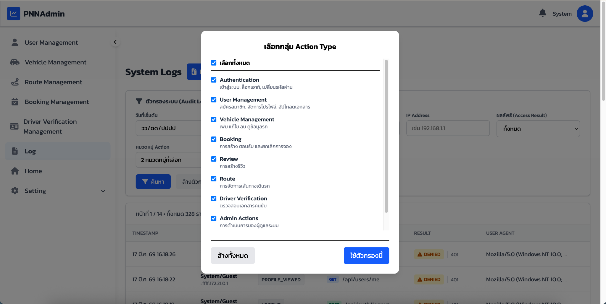

#### สำหรับการตรวจสอบความถูกต้องของฐานข้อมูล (Verify Integrity)

เมื่อทำการปุ่ม Verify Integrity ระบบจะทำการตรวจสอบว่าข้อมูลมีการเปลี่ยนแปลงข้อมูลจากระบบฐานข้อมูลหรือไม่

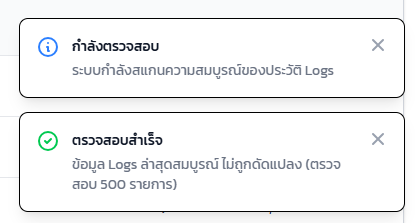


#### สำหรับการส่งออกข้อมูล (Export)

เมื่อกดปุ่ม Export ระบบจะให้เลือกข้อมูลเพิ่มเติม ซึ่งเป็นข้อมูลของผู้ใช้ ประกอบด้วย:

**ข้อมูลที่สามารถเลือก:**
- ชื่อผู้ใช้
- ชื่อ
- นามสกุล
- อีเมล
- เบอร์โทรศัพท์
- เลขบัตรประชาชน
- บทบาทผู้ใช้

เมื่อกดปุ่ม "Export Log File" จะสามารถดาวน์โหลด Log ที่กรองออกมาเป็นไฟล์: ZIP

เพื่อนำไปใช้ในทางกฎหมาย

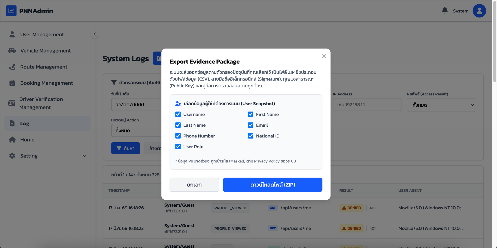

#### การตรวจสอบความถูกต้องของไฟล์ Log ที่ถูก Export

เมื่อกด Export จะได้ไฟล์ `.zip` เมื่อแตกไฟล์แล้วจะมี **4 ไฟล์** ดังนี้:

- `audit_log.csv` - ไฟล์ Log หลัก
- `howto.txt` - คู่มือการตรวจสอบ
- `public_key.pem` - คีย์สาธารณะ
- `signature.sig` - ลายเซ็นดิจิทัล

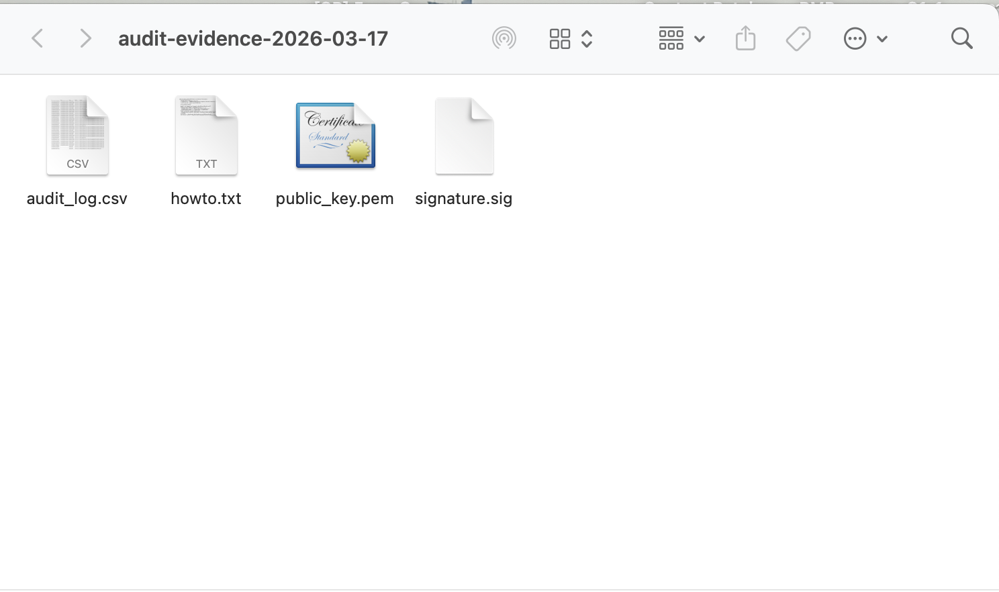

##### ไฟล์ howto.txt

เมื่อเปิดไฟล์ `howto.txt` จะแสดงเกี่ยวกับวิธีการตรวจสอบความถูกต้องของไฟล์

คู่มือการตรวจสอบควาถูกต้องของไฟล์ (Audit Log Integrity Verification)
  ข้อมูลในแพ็กเกจนี้ประกอบด้วย
  1. audit_log.csv - ข้อมูลบันทึกการใช้งานระบบ
  2. signature.sig - ลายมือชื่ออิเล็กทรอนิกส์ (Digital Signature) ที่สร้างด้วย Private Key ของระบบ
  3. public_key.pem - กุญแจสาธารณะสำหรับใช้ตรวจสอบ
  
  วิธีการตรวจสอบด้วย OpenSSL:
  -----------------------


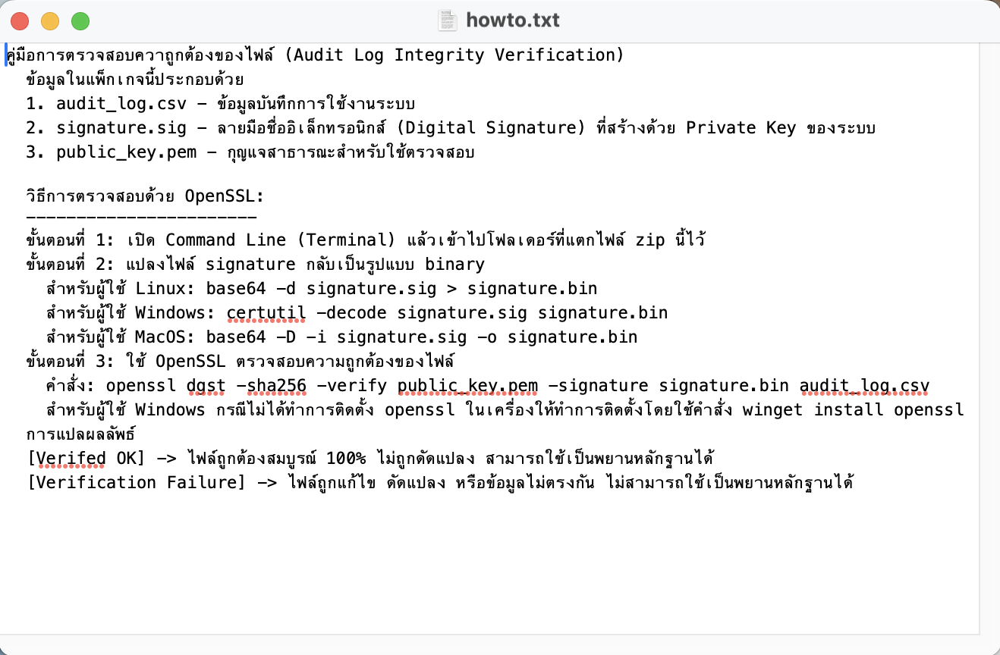
  ขั้นตอนที่ 1: เปิด Command Line (Terminal) แล้วเข้าไปโฟลเดอร์ที่แตกไฟล์ zip นี้ไว้
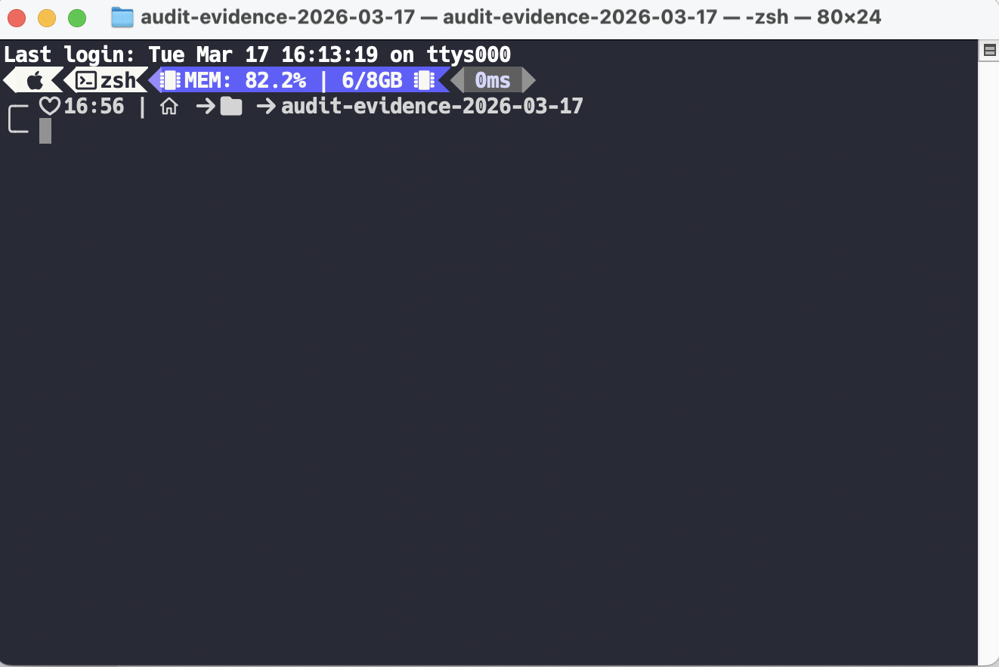
ขั้นตอนที่ 2: แปลงไฟล์ signature กลับเป็นรูปแบบ binary

- สำหรับผู้ใช้ Linux: 

```bash
base64 -d signature.sig > signature.bin
```

- สำหรับผู้ใช้ Windows: 

```bash
certutil -decode signature.sig signature.bin
```

- สำหรับผู้ใช้ MacOS:

```bash
base64 -D -i signature.sig -o signature.bin
```


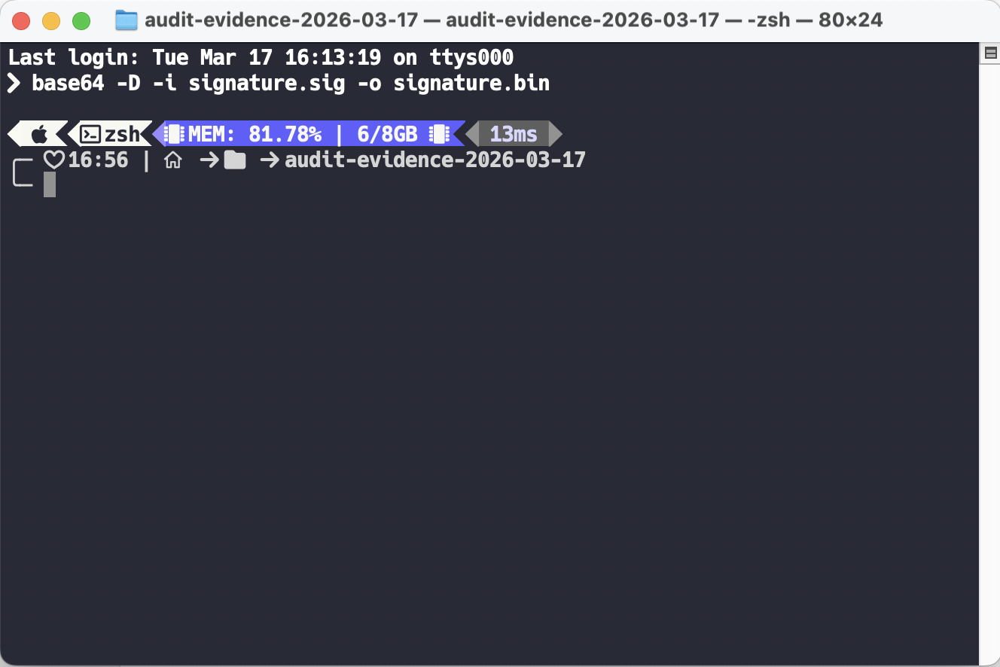
ขั้นตอนที่ 3: ใช้ OpenSSL ตรวจสอบความถูกต้องของไฟล์
	คำสั่ง: 
	
```bash
openssl dgst -sha256 -verify public_key.pem -signature signature.bin audit_log.csv
```

(สำหรับผู้ใช้ Windows กรณีไม่ได้ทำการติดตั้ง openssl ในเครื่องให้ทำการติดตั้งโดยใช้คำสั่ง winget install openssl)


##### ผลการตรวจสอบ

- ไฟล์ถูกต้องสมบูรณ์ 100% ไม่ถูกดัดแปลง สามารถใช้เป็นพยานหลักฐานได้ ระบบจะแสดง:**"Verification OK"** 

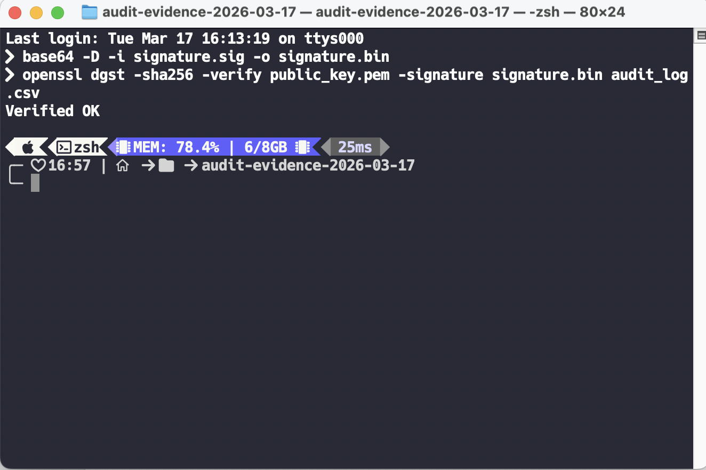

- หากไฟล์ CSV ถูกแก้ไขแล้วนำไปตรวจสอบความถูกต้อง ระบบจะแสดง: **"Verification Failure"**
  
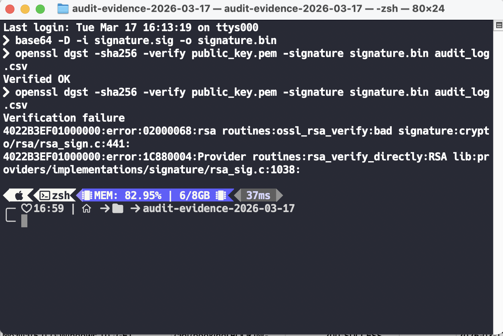

---

**สิ้นสุดคู่มือการใช้งาน** 