**คู่มือการใช้งาน PaiNamNae**    
\#15, \#16,\#1 (User Manual)

ยินดีต้อนรับสู่ PaiNamNae  
สารบัญ  
1\. \#15 As a passenger, I want to give a review for each ride that I took to support the community.  
2\. \#16 As a user, I want my account and information to be removed from the system when I am no longer want to be apart of this community.  
3\. \#1 As an admin, I want a log that complies to the related law.

**15\. As a passenger, I want to give a review for each ride that I took to support the community.**

ฟีเจอร์นี้ออกแบบมาเพื่อให้ผู้โดยสาร (Passenger) สามารถให้ข้อมูลย้อนกลับ (Feedback) เกี่ยวกับการเดินทาง เพื่อสร้างสังคมการใช้งานที่ดีและสนับสนุนคนขับที่มีคุณภาพ

ขั้นตอนการรีวิวการเดินทาง  
เมื่อการเดินทางสิ้นสุดลงและคนขับกดจบงาน ระบบจะแสดงหน้าจอสรุปการเดินทาง ผู้โดยสารสามารถดำเนินการได้ดังนี้:

1\.  การให้คะแนน (Rating)  
ผู้ใช้สามารถ กดเลือกจำนวนดาวที่คุณต้องการให้ (สูงสุด 5 ดาว) โดยที่ระบบรองรับการให้คะแนนแบบละเอียด (เช่น 3.5 หรือ 4.5 ดาว)

2\.  เลือกป้ายกำกับคำชม (Positive Labels)  
เลือกสิ่งที่ประทับใจจากตัวเลือกที่มีให้ ได้แก่ “ขับขี่ปลอดภัย”, “สะอาด รอน่านั่ง”,  
	   “คนขับอัธยาศัยดี”, “ชอบเพลงที่เปิด”  
3\. เขียนความคิดเห็น (Comment)  
	พิมพ์ข้อความรีวิวเพิ่มเติมในช่องว่างเพื่อบอกเล่าประสบการณ์

4\.  แนบรูปภาพ และวิดีโอ (Upload Photos and Videos)  
สามารถอัปโหลดรูปภาพและวิดีโอประกอบการรีวิวได้สูงสุด 3 ไฟล์และขนาดไม่เกิน 10 mb   
หากใส่ไฟล์ผิดประเภทจะขึ้นข้อความแจ้งเตือน  
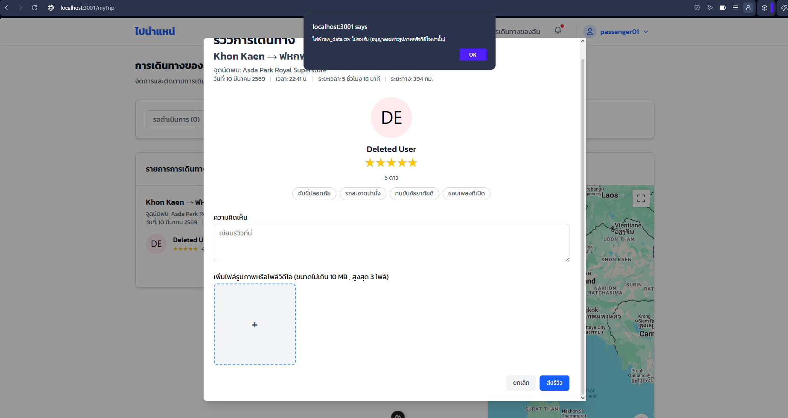

5\.  ยืนยันการรีวิว  
กดปุ่ม “บันทึก” เพื่อส่งรีวิวเมื่อกรอกข้อมูลครบถ้วน โดยจะสามารถรีวิวได้ภายใน 7 วันหลังจากการเดินทางสิ้นสุด  
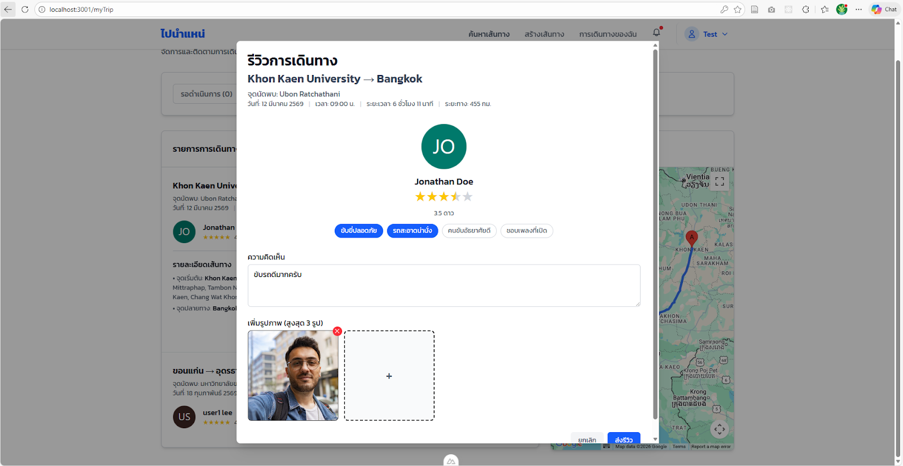

6\. การแสดงผล  
	เมื่อรีวิวเรียบร้อยแล้วจะแสดงผลดังภาพ โดยสามารถกดที่ไฟล์ภาพหรือวิดีโอเพื่อดูแบบเต็มจอได้  
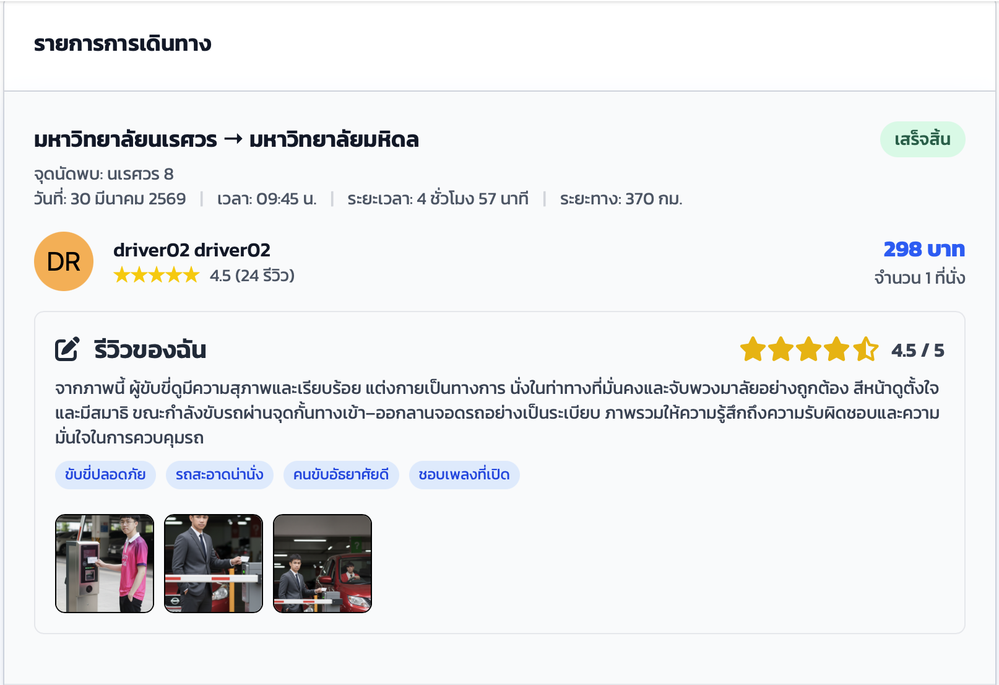  
\#16 As a user, I want my account and information to be removed from the system when I am no longer want to be apart of this community.

ฟีเจอร์นี้ช่วยให้ผู้ใช้งานจัดการข้อมูลส่วนบุคคลตาม พ.ร.บ. คุ้มครองข้อมูลส่วนบุคคล (PDPA) โดยการลบบัญชีถาวร

ขั้นตอนการขอลบบัญชี

1\. เข้าสู่เมนูตั้งค่า  
ในหน้า “โปรไฟล์ของฉัน” ผู้ใช้สามารถใช้เมนู “ลบบัญชีผู้ใช้ ” บริเวณแถบเมนูด้านซ้าย   
	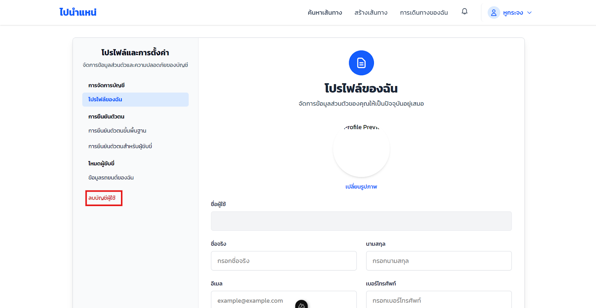

 2\.  ยอมรับเงื่อนไข  
	ระบบจะแสดงหน้าต่างแจ้งเตือนเกี่ยวกับผลกระทบของการลบบัญชี และนโยบาย PDPA ผู้ใช้สามารถคลิกที่ช่องสี่เหลี่ยม “ยอมรับข้อกำหนดและเงื่อนไข” จากนั้นกดปุ่ม           “ยืนยันการลบ”  

	  
3\.  การกรอกอีเมลเพื่อรับข้อมูล  
จากนั้นระบบจะให้กรอก “อีเมล (Email)” ของที่ผู้ใช้ต้องการรับข้อมูลแล้วทำการกดปุ่ม “ยืนยันการลบบัญชี”  
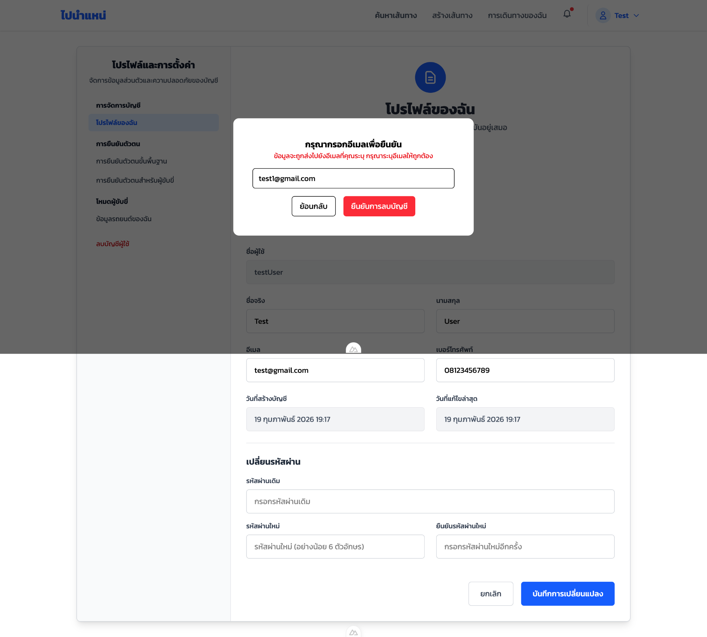

4\.  ยืนยันตัวตน  
	ระบบจะให้กรอก “รหัสผ่าน(Password)” ของบัญชีนั้นๆ อีกครั้งเพื่อยืนยันความปลอดภัยกรอกรหัสผ่านให้ถูกต้องแล้วกดปุ่ม “ยืนยัน” หากรหัสผ่านไม่ถูกต้องจำทำการแจ้งเตือนและย้อนกลับไปหน้าเดิม  
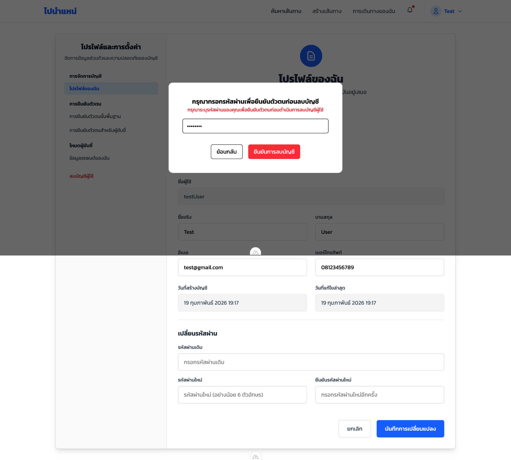
5\. การยืนยันอีกครั้ง  
	เมื่อรหัสผ่านถูกต้องระบบจะขึ้นหน้าให้ผู้ใช้กดปุ่ม “ยืนยัน” อีกครั้งเพื่อเป็นการยืนยันการลบบัญชี  
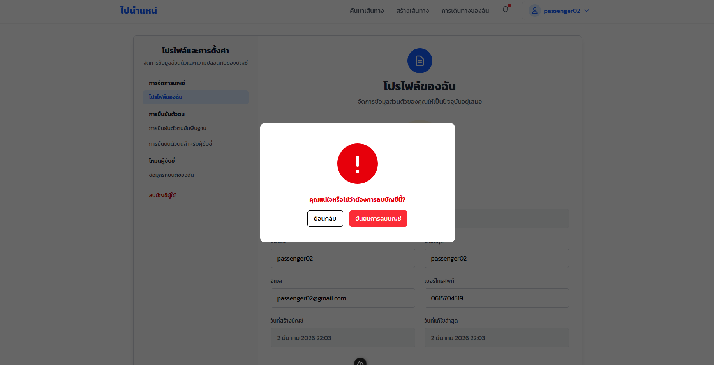  
6\. ตรวจสอบผลลัพธ์  
กรณีสำเร็จ : ระบบขึ้นแสดงเครื่องหมายถูกสีเขียว  “ลบบัญชีสำเร็จแล้ว” และส่งอีเมลยืนยันการลบข้อมูลตามกฎหมาย  
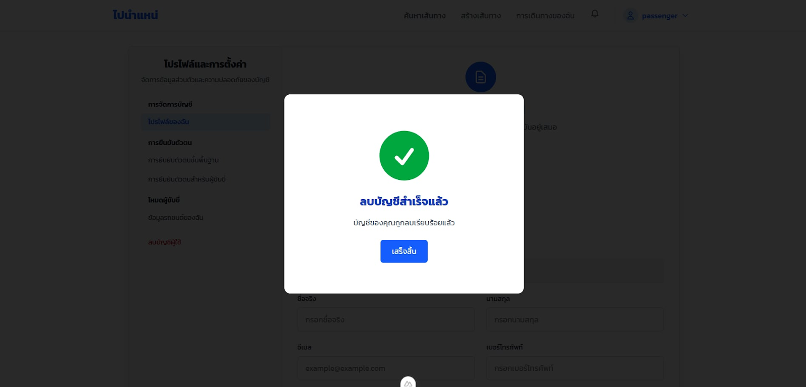  
	  
กรณีไม่สำเร็จ : หากคุณยังมีรายการค้างอยู่ (เช่น การเดินทางที่ยังไม่จบ) ระบบจะแจ้งเตือนให้คุณจัดการรายการเหล่านั้นให้เสร็จสิ้นก่อน จึงจะสามารถลบบัญชีได้  
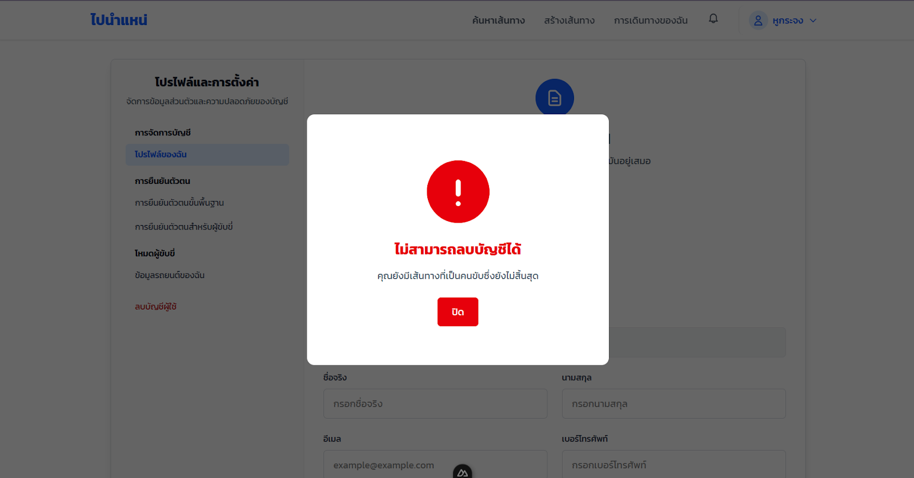

7\. การรับไฟล์  
เมื่อทำการลบบัญชีเรียบร้อยแล้ว ระบบจะทำการส่งไฟล์ไปที่อีเมลที่ผู้ใช้กรอกเข้าไป

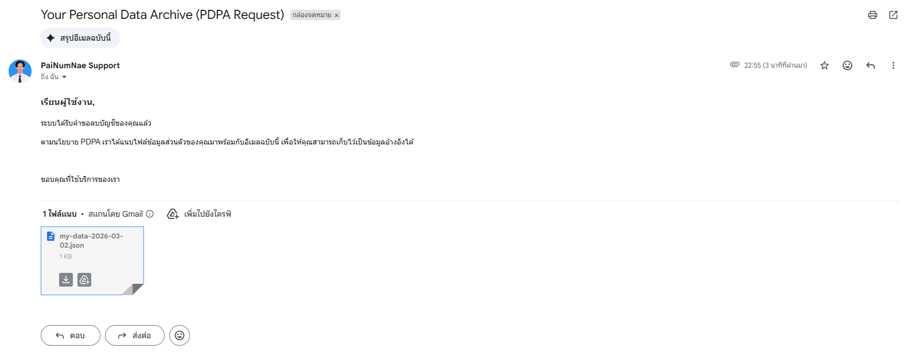

\#1 As an admin, I want a log that complies to the related law.

	ฟีเจอร์นี้ออกแบบมาเพื่อให้ผู้ดูแลระบบ (Admin) สามารถดูและส่งออกข้อมูล Log File ตาม พ.ร.บ. คอมฯ 2560 มาตรา 26

1\. หน้า Log System  
เมื่อผู้ดูแลเข้าสู่ระบบแล้วให้ทำการเข้าไปที่หน้า Dashborad เมนู Log จะอยู่ทางซ้ายมือดังภาพ  
โดย Action จะประกอบด้วย
* Authentication 
	* UNKNOWN	ไม่สามารถระบุประเภทการกระทำได้
	* LOGIN_SUCCESS	ผู้ใช้เข้าสู่ระบบสำเร็จ
	* LOGIN_FAILED	ผู้ใช้เข้าสู่ระบบไม่สำเร็จ (รหัสผ่านผิด/บัญชีไม่ถูกต้อง)
	* LOGOUT	ผู้ใช้ออกจากระบบ
	* PASSWORD_CHANGED	ผู้ใช้เปลี่ยนรหัสผ่านสำเร็จ
* User Management
	* USER_REGISTERED	ผู้ใช้สมัครสมาชิกสำเร็จ
	* USER_DELETED	บัญชีผู้ใช้ถูกลบ
	* PROFILE_VIEWED	มีการเข้าดูข้อมูลโปรไฟล์
	* PROFILE_UPDATED	ผู้ใช้อัปเดตข้อมูลโปรไฟล์
	* USER_DATA_EXPORT_REQUESTED	ผู้ใช้ร้องขอ Export ข้อมูลส่วนตัว
* Vehicle Management
	* VEHICLE_CREATED	เพิ่มข้อมูลรถใหม่เข้าสู่ระบบ
	* VEHICLE_UPDATED	แก้ไขข้อมูลรถ
	* VEHICLE_DELETED	ลบข้อมูลรถออกจากระบบ
	* VEHICLE_VIEWED	มีการเข้าดูข้อมูลรถ
* Booking  
	* BOOKING_CREATED	สร้างการจองใหม่
	* BOOKING_UPDATED	แก้ไขรายละเอียดการจอง
	* BOOKING_DELETED	ยกเลิก / ลบการจอง
	* BOOKING_VIEWED	มีการเข้าดูรายละเอียดการจอง
* Review
	* REVIEW_CREATED	ผู้ใช้สร้างรีวิวใหม่
* Route  
	* ROUTE_CREATED	สร้างเส้นทางใหม่
	* ROUTE_UPDATED	แก้ไขข้อมูลเส้นทาง
	* ROUTE_VIEWED	มีการเข้าดูข้อมูลเส้นทาง
	* ROUTE_DELETE	ลบข้อมูลเส้นทาง
* Driver Verification  
	* DRIVER_VERIFICATION_SUBMITTED	ผู้ขับส่งคำขอยืนยันตัวตน
	* DRIVER_VERIFICATION_UPDATED	มีการอัปเดตข้อมูลการยืนยันตัวตน
	* DRIVER_LICENSES_VIEWED	มีการเข้าดูข้อมูลใบขับขี่
* Admin Actions  
	* ADMIN_VIEWED	เข้าดูข้อมูลผู้ดูแลระบบ
	* ADMIN_CREATED	เพิ่มผู้ดูแลระบบใหม่
	* ADMIN_UPDATED	แก้ไขข้อมูลผู้ดูแลระบบ
	* ADMIN_DELETED	ลบผู้ดูแลระบบ
	* ADMIN_LOG_VIEWED	เข้าดูประวัติ Log ระบบ
	* ADMIN_LOG_EXPORTED	ส่งออกข้อมูล Log ระบบ
* System 
	* SYSTEM_ERROR	เกิดข้อผิดพลาดภายในระบบ
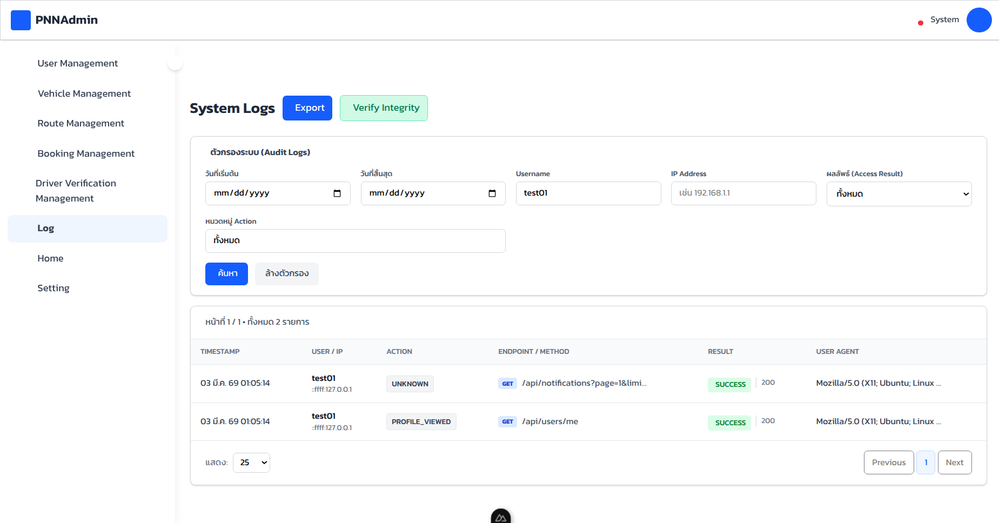  
2\.  การกรอง  
โดยเมื่อเข้าสู่หน้า Log จะแสดงฟิลเตอร์ต่างๆประกอบด้วย

* ระยะเวลา (วันที่เริ่มต้น วันที่สิ้นสุด)   
* การค้นหาชื่อผู้ใช้  
* IP address  
* ผลลัพธ์  
* หมวดหมู่

ซึ่งสามารถเลือกได้ว่าจะใช้ต้วกรองใดบ้างโดยไม่บังคับ โดยในหน้าของหมวดหมู่จะประกอบด้วย

* Authentication 
* User Management
* Vehicle Management
* Booking  
* Review
* Route  
* Driver Verification  
* Admin Actions  
* System 

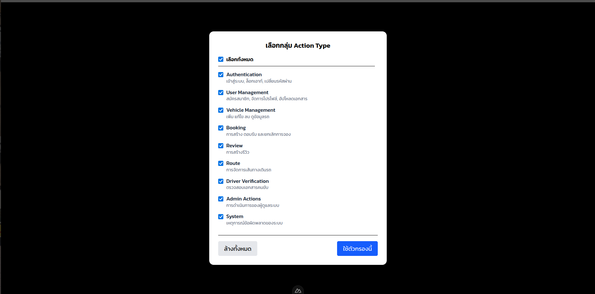

3\. การ Export  
โดยเมื่อกดปุ่ม Export จะขึ้นให้เลือกหน้าให้เลือกสิ่งที่ส่งออกเพิ่มเติมซึ่งเป็นข้อมูลของผู้ใช้ประกอบด้วย 

* ชื่อผู้ใช้  
* ชื่อ  
* นามสกุล  
* อีเมล   
* เบอร์โทรศัพท์   
* เลขบัตรประชาชน   
* บทบาทผู้ใช้

ซึ่งสามารถเลือกได้ว่าจะใช้ต้วกรองใดบ้างโดยไม่บังคับ และเมื่อคลิกปุ่ม export log file จะสามารถดาวน์โหลด Log ที่กรองออกมานั้นเป็นไฟล์ .json หรือ .csv เพื่อนำไปใช้ในทางกฎหมายได้  
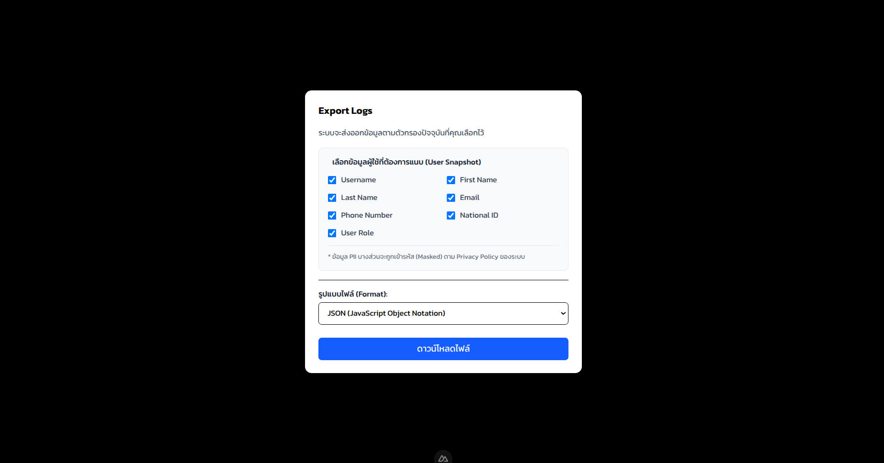
